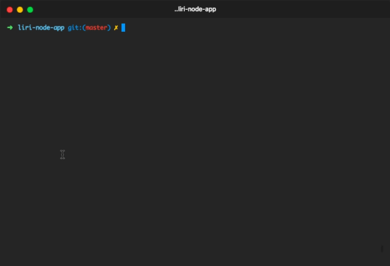

# LiriBOT  
## (Language Interpretation and Recognition Interface)

**8/12/18** Update: LIRI no longer takes command line arguments. Instead, simply running "node liri.js" will display a list of options
to choose from.  

**8/12/18** Update 2: LIRI now creates a log file after the first command is executed. The full output of a command is now logged into this text file, with the time the command was executed in 24hr format before each log entry. LIRI now also has an option to delete the entire log file.

**8/10/18** This is a small command line "bot" using Node.js. It can:

* Read first 20 tweets of specified Twitter screen name (currently twitterapi)  

  
* Search for a specified song from the Spotify API  

  
* Search for a specified movie from the OMDB API  

  
* Execute one random command placed into the random.txt file  

  
* Delete the log file  

  

*You will need to provide your own API keys for requests.*

*Node Packages Used:*
DotEnv,
Twitter,
Node-Spotify-API,
Request,
Chalk, 
Inquirer